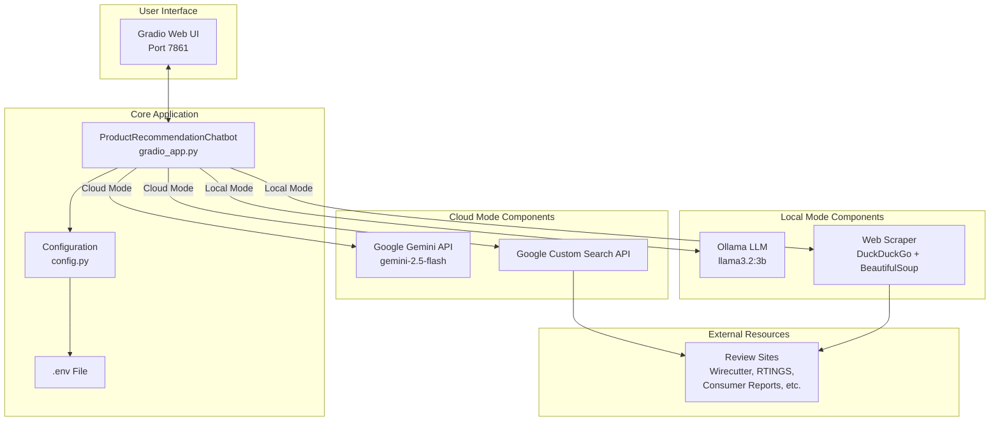
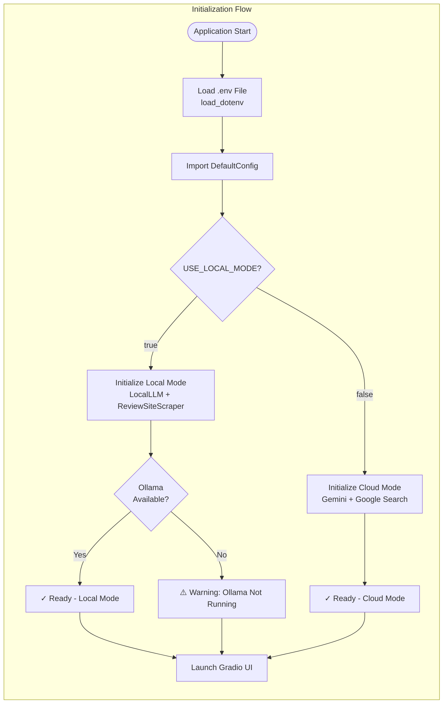
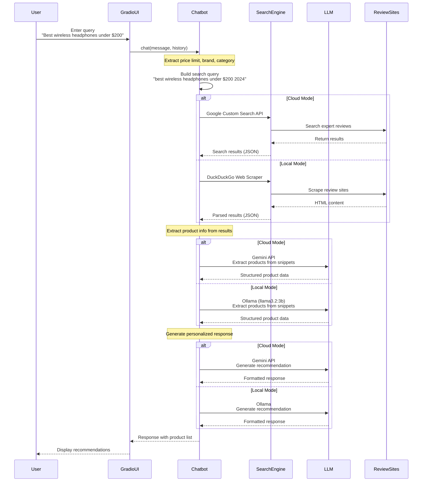
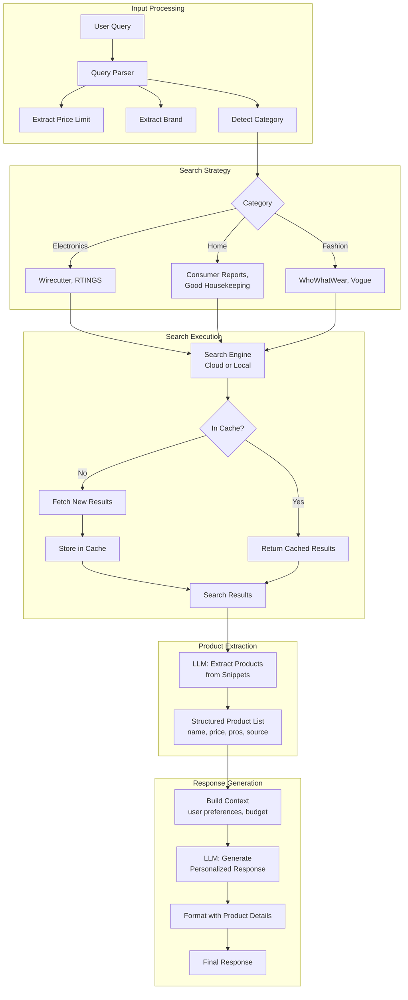
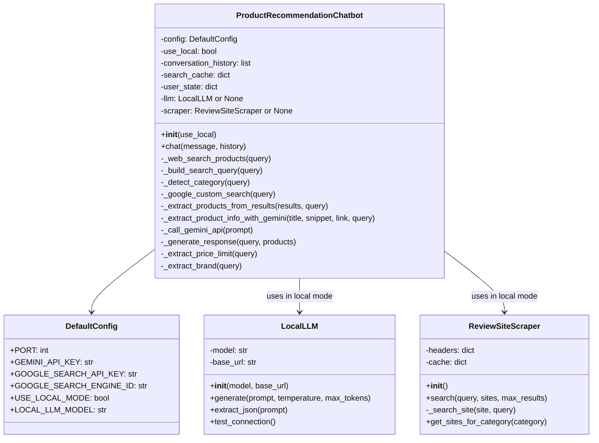
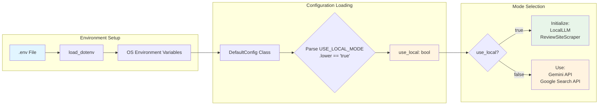

# Product Recommendation Chatbot - Architecture

## System Overview

The Product Recommendation Chatbot is a modular system that supports both **Cloud Mode** and **Local Mode** for product recommendations based on expert reviews.

---

## High-Level Architecture



---

## Detailed Component Architecture



---

## Request Processing Flow



---

## Data Flow Architecture



---

## Class Structure



---

## Mode Comparison

| Feature | Cloud Mode | Local Mode |
|---------|-----------|------------|
| **LLM** | Google Gemini API (gemini-2.5-flash) | Ollama (llama3.2:3b) |
| **Search** | Google Custom Search API | DuckDuckGo Web Scraper |
| **Cost** | API usage fees | Free (local compute) |
| **Speed** | Fast (cloud infrastructure) | Moderate (local hardware) |
| **Privacy** | Data sent to Google | Fully private |
| **Dependencies** | API keys required | Ollama + beautifulsoup4 + lxml |
| **Internet** | Required | Required (for scraping) |
| **Rate Limits** | API quotas apply | No limits |

---

## Configuration Flow



---

## Technology Stack

### Frontend
- **Gradio 4.44+**: Web UI framework with chat interface
- **Custom CSS**: Light theme with off-white background and red accents

### Backend (Cloud Mode)
- **Google Gemini API**: LLM for product extraction and response generation
- **Google Custom Search API**: Search expert review sites
- **Python Requests**: HTTP client for API calls

### Backend (Local Mode)
- **Ollama**: Local LLM server (llama3.2:3b model)
- **BeautifulSoup4**: HTML parsing for web scraping
- **lxml**: XML/HTML parser
- **DuckDuckGo**: Search engine (no API key required)

### Common Components
- **python-dotenv**: Environment variable management
- **Python 3.8+**: Runtime environment

---

## File Structure

```
product-recommendation-bot/
├── gradio_app.py          # Main application & UI
├── config.py              # Configuration management
├── local_llm.py           # Ollama LLM interface
├── web_scraper.py         # Web scraping for local mode
├── requirements.txt       # Python dependencies
├── .env                   # Environment variables (gitignored)
├── .env.example           # Example environment file
├── run.bat                # Windows launch script
├── README.md              # Project documentation
├── API_KEYS_GUIDE.md      # API setup instructions
└── TEAM_SETUP.md          # Team collaboration guide
```

---

## Key Design Decisions

### 1. **Modular Architecture**
- Clean separation between cloud and local components
- Easy to switch modes via configuration
- No code changes required to toggle modes

### 2. **Import Order Fix**
- `load_dotenv()` called **before** importing `DefaultConfig`
- Ensures environment variables are available when class variables are evaluated
- Critical for proper mode selection

### 3. **Caching Strategy**
- Search results cached to reduce API calls/scraping
- Rate limiting (2-second delay) for API requests
- Improves performance and respects rate limits

### 4. **Category-Based Site Selection**
- Different review sites for different product categories
- Electronics → Wirecutter, RTINGS
- Home → Consumer Reports, Good Housekeeping
- Fashion → WhoWhatWear, Vogue

### 5. **Graceful Degradation**
- Local mode warns if Ollama not running but doesn't crash
- Continues to function with available components
- User-friendly error messages

---

## Deployment Considerations

### Cloud Mode Requirements
1. Google Gemini API key
2. Google Custom Search API key + Search Engine ID
3. Internet connection
4. API quota management

### Local Mode Requirements
1. Ollama installed and running (`ollama serve`)
2. Model downloaded (`ollama pull llama3.2:3b`)
3. Python packages: `beautifulsoup4`, `lxml`
4. Internet connection (for web scraping)

### Running the Application
```bash
# Windows
.\run.bat

# Direct Python
python gradio_app.py
```

The application will automatically detect the mode based on `USE_LOCAL_MODE` in `.env` and initialize the appropriate components.
