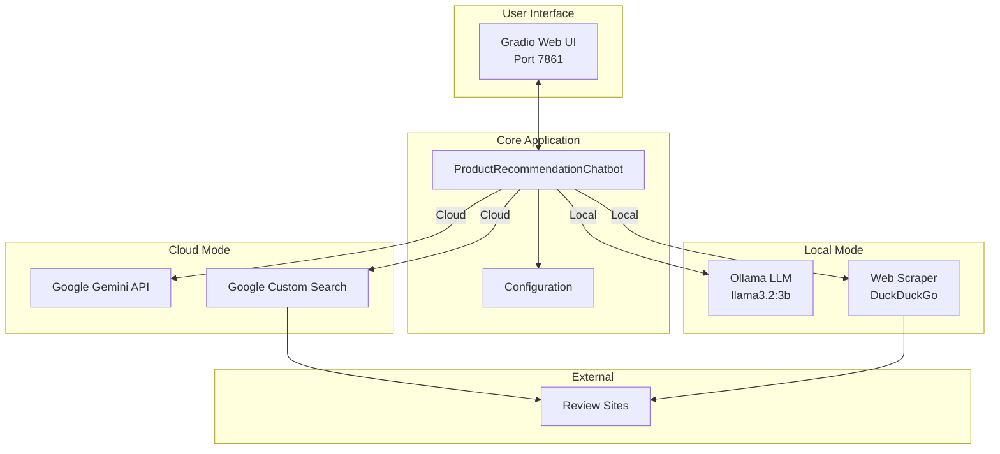

# Product Recommendation Chatbot - Complete Guide

> **AI-Powered Product Recommendations using Expert Reviews**

This comprehensive guide covers everything you need to know about setting up, using, and contributing to the Product Recommendation Chatbot.

---

## 📋 Table of Contents

1. [Overview](#overview)
2. [Quick Start](#quick-start)
3. [Getting the Code](#getting-the-code)
4. [Setup Instructions](#setup-instructions)
5. [Configuration](#configuration)
6. [Running the Application](#running-the-application)
7. [Architecture](#architecture)
8. [Team Collaboration](#team-collaboration)
9. [Troubleshooting](#troubleshooting)
10. [API Reference](#api-reference)

---

## Overview

### Features

- **🎯 Smart Category Detection**: Automatically detects product categories and searches appropriate review sites
  - Electronics → Wirecutter, RTINGS
  - Home Goods → Consumer Reports, Good Housekeeping
  - Fashion → Who What Wear, Vogue

- **🤖 Dual Mode Support**:
  - **Cloud Mode**: Google Gemini + Google Custom Search (fast, requires API keys)
  - **Local Mode**: Ollama LLM + Web Scraping (private, no API keys needed)

- **💬 Conversational Memory**: Remembers preferences (brand, price range) across conversation

- **🎨 Modern UI**: Clean Gradio web interface with accessibility features

### Technology Stack

- **Language**: Python 3.8+
- **UI Framework**: Gradio 4.44+
- **Cloud AI**: Google Gemini 2.5 Flash
- **Local AI**: Ollama (llama3.2:3b)
- **Search**: Google Custom Search API / DuckDuckGo scraping

---

## Quick Start

### For Team Members (Clone & Run)

```bash
# 1. Clone repository
git clone https://github.com/ShashiSwarnkar/MSAI_631.git
cd MSAI_631/product-recommendation-bot

# 2. Install dependencies
pip install -r requirements.txt

# 3. Configure (choose one mode)
cp .env.example .env
# Edit .env with your settings

# 4. Run
python gradio_app.py
```

Open browser to: **http://127.0.0.1:7861**

---

## Getting the Code

### Repository Information

**URL**: `https://github.com/ShashiSwarnkar/MSAI_631`

**Project Path**: `product-recommendation-bot/`

### Access Options

#### Option 1: Clone with Git
```bash
git clone https://github.com/ShashiSwarnkar/MSAI_631.git
cd MSAI_631/product-recommendation-bot
```

#### Option 2: Download ZIP (No Git Required)
1. Visit: https://github.com/ShashiSwarnkar/MSAI_631
2. Click green **"Code"** button
3. Click **"Download ZIP"**
4. Extract and navigate to `product-recommendation-bot/` folder

#### Option 3: View Online
Browse files directly at: https://github.com/ShashiSwarnkar/MSAI_631/tree/main/product-recommendation-bot

---

## Setup Instructions

### Prerequisites

- Python 3.8 or higher
- Git (optional, for cloning)
- Internet connection

### Step 1: Install Python Dependencies

#### Option A: Using pip
```bash
pip install -r requirements.txt
```

#### Option B: Using Conda (Recommended)
```bash
# Create environment
conda create -n MSAI631-MBF python=3.8

# Activate environment
conda activate MSAI631-MBF

# Install dependencies
pip install -r requirements.txt
```

#### Option C: Using venv
```bash
# Create virtual environment
python -m venv venv

# Activate (Windows)
.\venv\Scripts\activate

# Activate (Mac/Linux)
source venv/bin/activate

# Install dependencies
pip install -r requirements.txt
```

### Step 2: Choose Your Mode

The chatbot supports two modes. Choose based on your needs:

| Feature | Cloud Mode | Local Mode |
|---------|-----------|------------|
| **Setup** | Get API keys (~15 min) | Install Ollama (~10 min) |
| **Cost** | Free tier (100 searches/day) | Completely free |
| **Speed** | Fast (1-2s) | Moderate (3-5s) |
| **Privacy** | Data sent to Google | Fully private |
| **Requirements** | API keys | 8GB RAM, 10GB disk |

---

## Configuration

### Cloud Mode Setup

#### Step 1: Get Google Gemini API Key

1. Visit: https://aistudio.google.com/app/apikey
2. Sign in with Google account
3. Click **"Create API Key"**
4. Copy the key (starts with `AIza...`)

**Free Tier**: 60 requests/minute

#### Step 2: Get Google Custom Search API

**Part A: API Key**
1. Go to: https://console.cloud.google.com/
2. Create a new project (or use existing)
3. Enable **"Custom Search API"**: https://console.cloud.google.com/apis/library
4. Create credentials: https://console.cloud.google.com/apis/credentials
5. Click **"Create Credentials"** → **"API Key"**
6. Copy the API key

**Part B: Search Engine ID**
1. Go to: https://programmablesearchengine.google.com/
2. Click **"Add"** or **"Create new search engine"**
3. Name: "Product Reviews Search"
4. Add these sites:
   ```
   wirecutter.com
   rtings.com
   consumerreports.org
   goodhousekeeping.com
   whowhatwear.com
   vogue.com
   ```
5. Click **"Create"**
6. Copy the **Search Engine ID** (e.g., `a67b9550da4c04a5b`)

**Free Tier**: 100 searches/day

#### Step 3: Create `.env` File

In the `product-recommendation-bot/` folder, create `.env`:

```env
# Cloud Mode Configuration
GEMINI_API_KEY=AIzaSy...your_gemini_key
GOOGLE_SEARCH_API_KEY=AIza...your_search_key
GOOGLE_SEARCH_ENGINE_ID=your_search_engine_id
USE_LOCAL_MODE=false
```

**Important**:
- No quotes around values
- No spaces around `=`
- Keep this file private (already in `.gitignore`)

---

### Local Mode Setup

#### Step 1: Install Ollama

**Windows**:
1. Download from: https://ollama.com/download
2. Run installer
3. Restart computer

**Mac**:
```bash
curl -fsSL https://ollama.ai/install.sh | sh
```

**Linux**:
```bash
curl -fsSL https://ollama.ai/install.sh | sh
```

#### Step 2: Download Model

```bash
# Pull the model (2GB download)
ollama pull llama3.2:3b

# Verify installation
ollama list
```

#### Step 3: Install Additional Dependencies

```bash
pip install beautifulsoup4 lxml
```

#### Step 4: Create `.env` File

```env
# Local Mode Configuration
USE_LOCAL_MODE=true
LOCAL_LLM_MODEL=llama3.2:3b
```

#### Step 5: Start Ollama (if not running)

```bash
ollama serve
```

---

## Running the Application

### Windows

```bash
# Using batch file
.\run.bat

# Or directly
python gradio_app.py
```

### Mac/Linux

```bash
python gradio_app.py
```

### Expected Output

**Cloud Mode**:
```
☁️  Using CLOUD mode (Gemini + Google Custom Search)
Running on local URL:  http://127.0.0.1:7861
```

**Local Mode**:
```
🏠 Using LOCAL mode (Ollama + Web Scraping)
✓ Ollama is running and llama3.2:3b is available
Running on local URL:  http://127.0.0.1:7861
```

### Access the UI

Open your browser to: **http://127.0.0.1:7861**

### Example Queries

- "Best wireless headphones under $200"
- "Affordable laptop for students"
- "Best vacuum cleaner for pet hair"
- "Stylish winter boots for women"

---

## Architecture

### System Overview



### Request Flow

1. **User Query** → Gradio UI
2. **Query Processing** → Extract price, brand, category
3. **Search** → Google Custom Search OR Web Scraper
4. **Product Extraction** → Gemini OR Ollama extracts structured data
5. **Response Generation** → LLM generates personalized recommendation
6. **Display** → Formatted response with product list

### Project Structure

```
product-recommendation-bot/
├── gradio_app.py              # Main application & UI
├── config.py                  # Configuration management
├── local_llm.py               # Ollama LLM interface
├── web_scraper.py             # Web scraping for local mode
├── requirements.txt           # Python dependencies
├── .env                       # Environment variables (NOT in Git)
├── .env.example               # Example environment file
├── .gitignore                 # Git ignore rules
├── run.bat                    # Windows launcher
├── README.md                  # This file
└── ARCHITECTURE.md            # Detailed architecture diagrams
```

### Key Components

**ProductRecommendationChatbot** (`gradio_app.py`):
- Main chatbot logic
- Query processing
- Search coordination
- Response generation

**DefaultConfig** (`config.py`):
- Environment variable management
- Mode selection
- API key configuration

**LocalLLM** (`local_llm.py`):
- Ollama interface
- Local LLM communication
- Connection testing

**ReviewSiteScraper** (`web_scraper.py`):
- DuckDuckGo search
- HTML parsing
- Result extraction

---

## Team Collaboration

### Git Workflow

#### Daily Workflow

```bash
# 1. Pull latest changes
git pull origin main

# 2. Create feature branch
git checkout -b feature/your-feature-name

# 3. Make changes and test

# 4. Stage changes
git add .

# 5. Commit with descriptive message
git commit -m "Add: description of changes"

# 6. Push branch
git push origin feature/your-feature-name

# 7. Create Pull Request on GitHub
```

#### Commit Message Guidelines

- `Add: new feature or file`
- `Fix: bug fix`
- `Update: changes to existing code`
- `Refactor: code restructuring`
- `Docs: documentation changes`

**Examples**:
```bash
git commit -m "Add: local mode support with Ollama"
git commit -m "Fix: environment variable loading order"
git commit -m "Update: improve search query building"
```

### Branch Naming

- `feature/feature-name` - New features
- `fix/bug-description` - Bug fixes
- `docs/what-changed` - Documentation
- `refactor/what-changed` - Code refactoring

### Code Review

1. All changes via Pull Requests
2. At least one team member reviews
3. Address comments before merging
4. Test locally before requesting review

### Security Best Practices

#### ⚠️ NEVER commit:
- `.env` file (contains API keys)
- Personal credentials
- Large model files

#### ✅ ALWAYS:
- Use `.env.example` as template
- Keep API keys in `.env` only
- Review changes before committing
- Add sensitive files to `.gitignore`

---

## Troubleshooting

### Common Issues

#### "Local modules not available"
**Solution**: Install dependencies
```bash
pip install beautifulsoup4 lxml
```

#### "Ollama not running"
**Solution**: Start Ollama
```bash
ollama serve
```

#### "Model not found"
**Solution**: Pull the model
```bash
ollama pull llama3.2:3b
```

#### "API key invalid"
**Solution**:
- Check `.env` file has correct keys
- No extra spaces or quotes
- Verify keys are active in Google Cloud Console

#### "Module not found" errors
**Solution**: Activate environment
```bash
# Conda
conda activate MSAI631-MBF

# venv
.\venv\Scripts\activate  # Windows
source venv/bin/activate  # Mac/Linux
```

#### "Port 7861 already in use"
**Solution**: Change port in `gradio_app.py` (line ~500):
```python
demo.launch(share=False, server_name="127.0.0.1", server_port=7862)
```

#### "Quota exceeded" (Cloud Mode)
**Solution**:
- Wait 24 hours for quota reset
- Switch to local mode
- Upgrade API plan

#### Environment variable not loading
**Solution**: Ensure `.env` file format is correct:
```env
USE_LOCAL_MODE=true
# No spaces around =
# No quotes around values
```

### Verification Steps

1. **Check Python version**:
   ```bash
   python --version  # Should be 3.8+
   ```

2. **Check dependencies**:
   ```bash
   pip list | grep gradio
   ```

3. **Test Ollama** (local mode):
   ```bash
   ollama list
   ollama run llama3.2:3b "Hello"
   ```

4. **Check environment variables**:
   ```bash
   # Windows
   type .env
   
   # Mac/Linux
   cat .env
   ```

---

## API Reference

### Environment Variables

| Variable | Required | Mode | Description |
|----------|----------|------|-------------|
| `GEMINI_API_KEY` | Yes | Cloud | Google Gemini API key |
| `GOOGLE_SEARCH_API_KEY` | Yes | Cloud | Google Custom Search API key |
| `GOOGLE_SEARCH_ENGINE_ID` | Yes | Cloud | Custom Search Engine ID |
| `USE_LOCAL_MODE` | No | Both | `true` for local, `false` for cloud |
| `LOCAL_LLM_MODEL` | No | Local | Ollama model name (default: `llama3.2:3b`) |

### API Limits

#### Cloud Mode
- **Gemini API**: 60 requests/minute (free)
- **Custom Search**: 100 queries/day (free)
- **Rate Limiting**: 2-second delay between searches
- **Caching**: Results cached to conserve quota

#### Local Mode
- **No API limits**
- **No quotas**
- **Fully offline** (after setup)

### Category-Specific Sites

| Category | Review Sites |
|----------|-------------|
| Electronics | Wirecutter, RTINGS |
| Home Goods | Consumer Reports, Good Housekeeping |
| Fashion | Who What Wear, Vogue |

---

## Additional Resources

### Documentation
- **Architecture Details**: See `ARCHITECTURE.md` for detailed diagrams
- **API Setup**: Detailed steps above in Configuration section

### External Links
- **Gemini API Docs**: https://ai.google.dev/docs
- **Custom Search Docs**: https://developers.google.com/custom-search/v1/overview
- **Ollama Docs**: https://ollama.ai/docs
- **Gradio Docs**: https://gradio.app/docs

### Support

**If you encounter issues**:
1. Check this guide's Troubleshooting section
2. Search existing issues on GitHub
3. Create a new issue with:
   - Description of problem
   - Steps to reproduce
   - Error messages
   - Your environment (OS, Python version, mode)

---

## Project Information

**Course**: MSAI 631 - Human-Computer Interaction

**Repository**: https://github.com/ShashiSwarnkar/MSAI_631

**License**: Educational project

---

## Quick Reference Commands

```bash
# Clone repository
git clone https://github.com/ShashiSwarnkar/MSAI_631.git

# Setup environment
conda create -n MSAI631-MBF python=3.8
conda activate MSAI631-MBF
pip install -r requirements.txt

# Configure
cp .env.example .env
# Edit .env with your settings

# Run (Windows)
.\run.bat

# Run (Mac/Linux)
python gradio_app.py

# Git workflow
git pull origin main
git checkout -b feature/my-feature
git add .
git commit -m "Add: my feature"
git push origin feature/my-feature

# Ollama (local mode)
ollama pull llama3.2:3b
ollama serve
ollama list
```

---

**Happy Coding! 🚀**

For questions, create an issue on GitHub or contact the repository maintainer.
